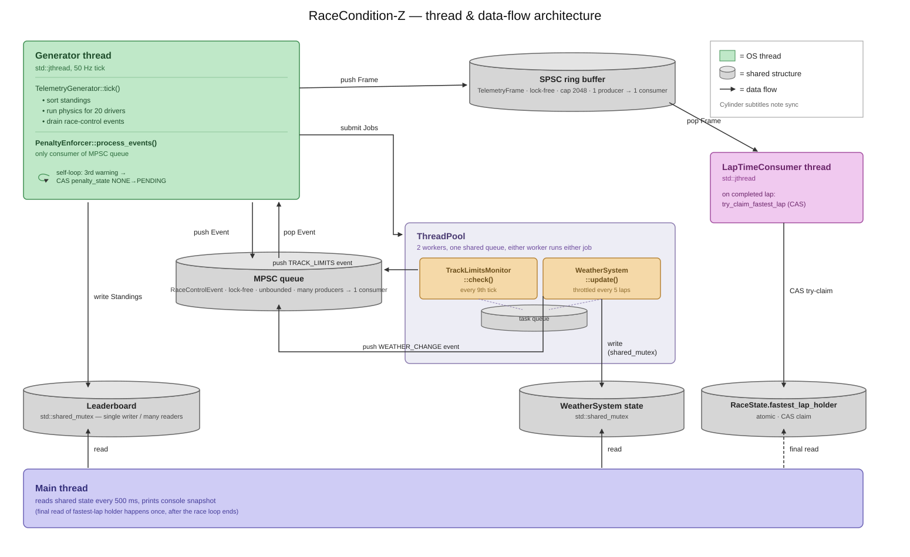

# RaceCondition-Z

A multithreaded F1 telemetry simulator with 20 drivers streaming physics-based telemetry at 50 Hz across five threads, coordinated by lock-free queues and CAS state machines on the hot paths, with a `shared_mutex` SWMR pattern where shared reads are necessary.

## The five threads

1. **Generator thread** (`std::jthread`) — runs the physics tick at 50 Hz: updates all 20 drivers, publishes standings to the `Leaderboard`, pushes `TelemetryFrame`s into the SPSC ring buffer, and drains the MPSC event queue via `PenaltyEnforcer::process_events()`.
2. **ThreadPool worker 1** — runs `TrackLimitsMonitor::check()` off the generator thread (every 9th tick), pushing `TRACK_LIMITS` events into the MPSC queue.
3. **ThreadPool worker 2** — runs `WeatherSystem::update()` (self-throttled every 5 laps), pushing `WEATHER_CHANGE` events into the MPSC queue and writing weather state under a `shared_mutex`. (Either worker can run either job.)
4. **LapTimeConsumer thread** (`std::jthread`) — the SPSC queue's consumer: drains `TelemetryFrame`s and, on a completed lap, races to claim the fastest lap via `RaceState::try_claim_fastest_lap` (CAS retry loop).
5. **Main thread** — every 500 ms while the race runs, reads `Leaderboard`, `WeatherSystem`, and per-driver `PenaltyEnforcer` state; after the loop exits, reads the final standings and fastest-lap holder for the summary.

## At a glance

| | |
|---|---|
| **Language** | C/C++, Python |
| **Build** | CMake, GoogleTest |
| **Concurrency primitives** | ock-free SPSC ring buffer + Vyukov-style MPSC intrusive linked list; CAS state machines; `ThreadPool` (`packaged_task`/`future`, 2 workers, one shared queue); `std::shared_mutex` SWMR for `Leaderboard` and `WeatherSystem` |
| **Memory ordering** | explicit `acquire`/`release` throughout |
| **Tests** | 55 GoogleTest cases across 6 CTest binaries; dedicated multi-thread stress tests for every concurrent primitive |
| **Sanitizers** | test suites and the live binary both run clean under ThreadSanitizer |
| **Benchmarks** | every lock-free structure measured against a `std::mutex`+`std::deque` baseline on the same workload (SPSC ring buffer: **~12× faster**) |
| **Size** | ~1,600 lines of implementation, ~965 lines of tests |

## Build & run

**Prerequisites:** a C++23 compiler (Clang 15+ or GCC 12+), CMake ≥ 3.20, and Python 3 (for the benchmark harness). The first configure needs network access — `FetchContent` pulls GoogleTest v1.14.0.

```bash
# configure + build
cmake -S . -B build -DCMAKE_BUILD_TYPE=Release
cmake --build build -j

# run a full race to the finish
./build/src/RaceCondition-z
```

Race parameters (lap count, driver count, tick rate) are hardcoded — there are no CLI flags.


*A live race: a mid-race snapshot with a car in the pits and a track-limits penalty, then the final classification and the fastest lap — claimed via a real cross-thread CAS race.*

## Architecture



**The two queues.** The SPSC ring buffer carries the high-rate telemetry stream (one producer, one consumer). The MPSC queue carries low-rate race-control events from up to three concurrent producers — the two pool workers plus the generator's own `PENALTY_ISSUED` self-push — into a single consumer (`PenaltyEnforcer::process_events()`, on the generator thread). The pool workers are the only place the MPSC multi-producer contract is exercised concurrently outside the stress tests.

## Testing

```bash
ctest --test-dir build --output-on-failure          # all 6 suites
ctest --test-dir build -R test_concurrency -V       # just the queue/pool suite
./build/tests/test_concurrency                       # run one suite's binary directly
```


*Release build, the full CTest run, and ThreadSanitizer on the live binary — 0 warnings, not just the isolated test suites.*

55 GoogleTest cases across 6 CTest binaries (`test_types`, `test_concurrency`, `test_telemetry`, `test_simulation`, `test_race_control`, `test_shared_state`):

- **Pure-logic unit tests** — penalty escalation, track-limits rate calibration, weather transitions, leaderboard ordering and gap formatting.
- **Multi-thread stress tests** — one per concurrent primitive: `SpscQueueTest.ConcurrentStress`, `MpscQueueTest.MultiProducerStress` / `NoItemsLostConcurrent`, `ThreadPoolTest.SharedAtomicCounter` / `DestructorJoinsCleanly`, `LeaderboardTest.SwmrNoTearing`, `RaceStateTest.LapCounterNoLostUpdates` / `FastestLapCasExactlyOneWinner` / `ReleaseAcquireHappensBefore`, `LapTimeConsumerTest.ConcurrentConsumersExactlyOneWinner`.

### ThreadSanitizer

Both the test suites and the live `RaceCondition-z` binary run clean under TSan:

```bash
cmake -S . -B build-tsan -DCMAKE_BUILD_TYPE=Debug -DCMAKE_CXX_FLAGS="-fsanitize=thread -g -O1"
cmake --build build-tsan -j
ctest --test-dir build-tsan --output-on-failure   # test suites
./build-tsan/src/RaceCondition-z                   # the live binary
```

## Benchmarks

```bash
python3 benchmarks/benchmark.py        # builds rcz_bench in -O3 and runs it
python3 benchmarks/benchmark.py --run  # re-run without rebuilding
```


*`benchmarks/benchmark.py` driving the `-O3` benchmark binary — real numbers from the machine it ran on.*

The harness builds `rcz_bench` in `-O3`/`NDEBUG` and runs it — every number below is reproducible on your own machine. Each lock-free structure is measured against a `std::mutex`+`std::deque` baseline on the identical workload; the SPSC queue also gets a cache-line-padding ablation (`alignas(64)` vs `alignas(8)`), so the padding claim in its doc comment is a measured number, not an assertion.

Figures below are from two runs on an **Apple M1 (8 cores)**. Throughput and tail latencies vary run-to-run with background load — the end-to-end pipeline latency especially (it folds in consumer scheduling delay).

| Component | Measurement | Result |
|---|---|---|
| SPSC ring buffer | 1 producer → 1 consumer, 10M `TelemetryFrame`s | **~28M ops/sec** |
| SPSC vs `std::mutex`+`std::deque` | same workload | mutex ~2.4M ops/sec → **~12× faster** |
| SPSC vs no cache-line padding | `alignas(8)` instead of `alignas(64)` | unpadded ~21M ops/sec → padding is **1.3× faster** |
| SPSC `push()` latency | 100K samples, isolated | p50 42 ns / p95 84 ns / p99 84 ns |
| MPSC event queue | 4 producers → 1 consumer | **~10M ops/sec** aggregate |
| MPSC vs `std::mutex`+`std::deque` | same workload, same producer count | mutex ~5.8M ops/sec → **1.7× faster** |
| MPSC `push()` latency | 4 producers, 80K samples | p50 ~300 ns / p95 ~600 ns / p99 ~800 ns / p99.9 ~1.5 µs |
| Thread pool dispatch | 8 workers, 80K tasks, submit→start latency | p50 ~4 µs / p95 14 µs / p99 23 µs / p99.9 40 µs |
| Leaderboard SWMR reads | 7 readers + 1 writer, 20-driver snapshot copy | **~2M reads/sec** |
| Leaderboard write latency | writer's `update()` under concurrent read load | p50 ~290 ns / p95 ~35 µs / p99 ~65 µs / p99.9 ~118 µs |
| End-to-end pipeline | SPSC push→pop round-trip, 100K samples | p50 45–215 µs / p99 140–245 µs (run-dependent) |

### Where the numbers could go further

The current speedups (SPSC padding 1.3×, MPSC vs mutex 1.7×) are modest because each structure has one dominant cost the lock-free rewrite doesn't remove. The next levers:

- **MPSC — kill the per-push allocation.** Add a node freelist so popped nodes are recycled instead of `new`/`delete`d on every push, or switch to a bounded array-based MPSC ring buffer (no allocation at all, at the cost of a fixed capacity and a backpressure path). This is the single biggest lever — the 1.7× is allocator-bound, not lock-bound.
- **SPSC — batch and shrink.** At ~28M ops/sec the `TelemetryFrame` copy dominates, not the atomics. Batched push/pop (amortise the index load/store and the cached-index refresh over N elements) and a tighter `TelemetryFrame` layout would move throughput more than any further queue tuning.
- **End-to-end latency — stop polling.** The 45–245 µs p50/p99 spread is consumer wakeup jitter, not queue-op cost (`push()` is 42 ns). Replace the consumer's sleep/poll loop with a blocking `atomic::wait`/futex so it wakes on data rather than on a timer; pin threads to cores and raise QoS to cut scheduler migration jitter.
- **Thread pool — per-worker queues.** The single shared task queue serialises submission. Per-worker queues with work-stealing plus `atomic::wait` instead of a condvar would trim the ~4 µs p50 submit→start path.
- **Fairer baselines.** The `std::mutex` baselines run under low-to-moderate contention on an M1, where an uncontended mutex is cheap; the lock-free gap widens with more cores and more producers. Building with LTO + PGO would also shift the absolute numbers.

## Project layout

```
src/
├─ common/            plain data + shared state
│  ├─ types.h            DriverState, TelemetryFrame, RaceControlEvent, enums
│  ├─ season_data.h      driver/team roster
│  ├─ leaderboard.h      shared_mutex SWMR standings store
│  └─ race_state.h       atomic race flags + fastest-lap CAS claim
├─ concurrency/       the hand-written primitives
│  ├─ spsc_queue.h       lock-free single-producer/single-consumer ring buffer
│  ├─ mpsc_queue.h       lock-free Vyukov-style multi-producer queue
│  └─ thread_pool.{h,cpp}  packaged_task / future pool, 2 workers
├─ simulation/
│  ├─ telemetry_generator.{h,cpp}   50 Hz physics tick, SPSC producer, TOTAL_LAPS
│  └─ lap_time_consumer.{h,cpp}     SPSC consumer, fastest-lap claim
├─ race_control/
│  ├─ track_limits.{h,cpp}     track-limits violation detection
│  ├─ penalty_enforcer.{h,cpp} MPSC consumer, CAS penalty state machine
│  └─ weather.{h,cpp}          weather transitions + grip factor
└─ main.cpp           wires it all together, runs the race, prints the console UI

tests/        GoogleTest suites, mirrors src/ layout
benchmarks/   bench_main.cpp + benchmark.py harness
docs/         screenshots + architecture.svg
lessons/      write-ups on the thread pool and race-control design
```

## Design notes & trade-offs

- **MPSC's advantage over a mutex is small (1.7×) by design.** Every push heap-allocates a node ([mpsc_queue.h](src/concurrency/mpsc_queue.h)); that allocator cost is paid with or without a lock, so removing the lock alone can't close the gap. The 8.8×→12× SPSC number and the 1.7× MPSC number together tell that story.
- **Single-flight job submission instead of locking inside the systems.** `TrackLimitsMonitor` and `WeatherSystem` carry unsynchronized RNG state, so two pool workers in the same instance would race. Rather than add a mutex to each class, the generator guards each job with a stored `std::future` so at most one call is ever in flight.
- **`states` is copied by value before `TrackLimitsMonitor::check()`.** Capturing the generator's live vector by reference would race with the next tick's mutation of it.
- **TUI was dropped.** An earlier plan used `ftxui` for a live dashboard; it was removed to keep the focus on the concurrency core. The console printout in `main.cpp` is the current UI.
